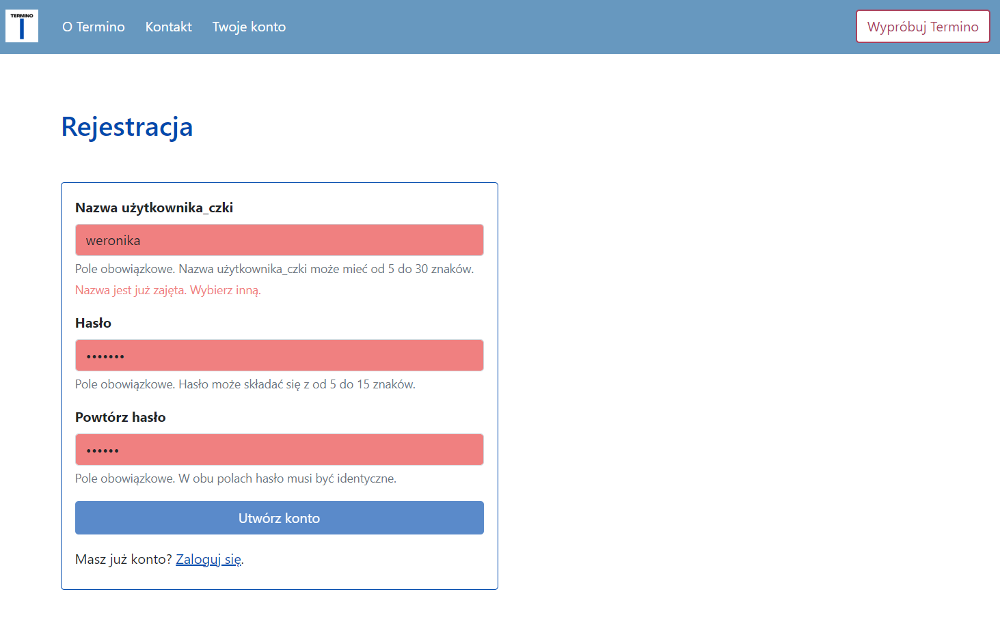

# Termino – aplikacja do przechowywania słownictwa

— English below —

## Opis projektu

<strong>Termino</strong> to aplikacja mojego pomysłu pozwalająca tworzyć słowniki i przechowywać w nich słownictwo. Jej część backendowa to RESTowe API napisane w Typescripcie, Node.js i Express.js z użyciem relacyjnej bazy danych. Część frontendowa, napisana również w Typescripcie i z użyciem biblioteki React.js i frameworka Bootstrap, znajduje się <a href="https://github.com/WeronikaSzemi/TerminoFront">tutaj</a>.

### Funkcjonalności:

<ul>
  <li>Na <strong>stronie głównej</strong> można przeczytać o aplikacji i skorzystać z formularza kontaktowego.</li>
  <li>Nowe osoby mogą <strong>zarejestrować się</strong>, podając nazwę użytkownika_czki i hasło.</li>
  <li>Następnie możliwe jest <strong>zalogowanie się</strong> dające dostęp do aplikacji.</li>
  <li>Z <strong>panelu użytkownika_czki</strong> można przejść do widoku słowników, usunąć konto i wylogować się.</li>
  <li>Po wejściu w <strong>widok słowników</strong> otrzymuje się listę swoich słowników oraz można utworzyć nowy. Każdy słownik można wczytać oraz usunąć.</li>
  <li>Po wejściu w dany słownik otrzymujemy <strong>listę haseł</strong>, które można wczytywać, edytować i usuwać. Można też dodawać nowe.</li>
  <li>Po wczytaniu <strong>pojedynczego hasła</strong> widzimy jego szczegóły, czyli wszystkie dostępne pola.</li>
</ul>

### Zastosowane języki i narzędzia:

<ul>
  <li></li> 
  <li>
  <li></li>
  <li></li>
  <li>MySQL</li>
</ul>

## Kolejne kroki

W planach są dalsza rozbudowa i dopracowywanie aplikacji. W szczególności zamierzam:
<ul>
  <li>dodać możliwość zmiany hasła</li>
  <li>dodać podpowiadanie zapomnianego hasła</li>
  <li>umożliwić sortowanie słowników oraz haseł po dacie utworzenia i dacie modyfikacji</li>
  <li>podawać w tabeli słowników informację o liczbie haseł</li>
  <li>umożliwić zmianę nazwy słownika</li>
  <li>dodać wyświetlanie kolokacji w formie listy</li>
  <li>dodać kolejne pola w słownikach, m.in. na synonimy</li>
  <li>umożliwić samodzielny wybór pól przy tworzeniu słownika oraz jego późniejszą edycję</li>
  <li>dodać funkcję eksportu słownika w formacie pozwalającym na import do narzędzi CAT</li>
</ul>
… i wiele innych!

---------------------------------- ENGLISH ----------------------------------

# Termino – an app for storing vocabulary

## Project description

<strong>Termino</strong> is an application I conceived that enables its users to create glossaries and store vocabulary. Its back-end section is a  RESTful API written in Typescript, Node.js and Express.js and with the use of MySQL. The front-end application, written likewise in Typescript and with the use of the React.js library and the Bootstrap framework, is available <a href="https://github.com/WeronikaSzemi/TerminoFront">here</a>.

### Functionalities:
<ul>
  <li>The <strong>homepage</strong> provides information about the app and a contact form.</li>
  <li>New users can <strong>sign up</strong> by giving a user name and password.</li>
  <li>Then, they can <strong>sign in</strong> to access the application.</li>
  <li>From the <strong>dashboard</strong>, they can view their glossaries, delete their account and log out.</li>
  <li>After entering the <strong>glossaries view</strong>, you see the list of your glossaries and can create a new one. Each glossary can be loaded or deleted.</li>
  <li>When you open a specific glossary, you see the <strong>list of entries</strong>, which can be further viewed, edited, and deleted. You can also add new entries.</li>
  <li>In <strong>single entry view</strong>, you see its individual fields.</li>
</ul>

### Languages and technologies used:
<ul>
  <li>TypeScript</li>
  <li>JavaScript</li>
  <li>Node.js</li>
  <li>Express.js</li>
  <li>MySQL</li>
</ul>

## Nest steps

I am planning to further develop and improve the app. In particular, I intend to:
<ul>
  <li>add the option to change password</li>
  <li>add help in case a user forgets their password</li>
  <li>enable sorting glossaries and entries by date of creation and date of modification</li>
  <li>provide the number of entries for each glossary in the glossary list view</li>
  <li>enable the option to rename a glossary</li>
  <li>render collocations in the form of a list</li>
  <li>add next glossary fields, such as synonyms</li>
  <li>enable the user to choose the fields their glossary should have and edit this setting later</li>
  <li>add the option to export the glossary in a format that enables its import into CAT tools</li>
</ul>
… and much more!
